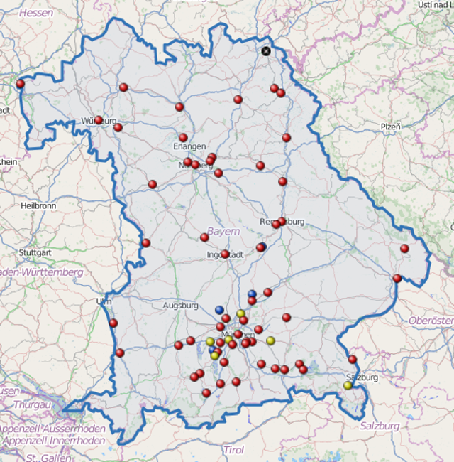

# Informationsfreiheit in Bayern

## Informationsfreiheit als Voraussetzung für politische Partizipation

### Klaus 'klml' Mueller

---
# Wer?

## Bündnis Informationsfreiheit für Bayern

Seit 2004

* Transparency International (TI), Deutschland e.V.
* Humanistische Union e.V. Landesverband Bayern
* Mehr Demokratie e.V.
* wwMehr Demokratie e.V.

Inzwischen haben sich zahlreiche Organisationen und Parteien dem Bündnis an­ge­schlossen.

[informationsfreiheit.org/bundnis/](http://informationsfreiheit.org/bundnis/)

---
# Informationsfreiheits-Gesetz?

Was ist das Informationsfreiheits-Gesetz?

* **Recht** auf einen voraus­set­zungs­losen Zugang
* öffentliche Informationen gehören der **Allgemeinheit**, nicht der Behörde
* **bedingungslos**: kostenneutral, jedermann, nicht nur mit 'berechtigtem Interesse'

als Voraussetzung für politische Partizipation

[informationsfreiheit.org/argumente](http://informationsfreiheit.org/argumente/)

---

# Selbstverständnis?

 

---
# Nutzen

Wem nützt Informationsfreiheit

* Informationsgleichstand von Behörden und **Bürgerinitiativen**
* wählender **Bürger** zur 'Aufsichtspflicht'
* Quellen für **Journalisten**
* Wirtschaftsunternehmen
* **Rechtssicherheit** Behörden-Mitarbeiter
* **Vertrauen** in Politiker
* mehr effektive Rechtstaatlichkeit und offenere Gesellschaft (OECD Vergleich)

[informationsfreiheit.org/wozu](http://informationsfreiheit.org/wozu)

---

# aktuelle Lage

 

* 1766 Schweden
* 1951 Finnland, 1970 Dänemark und Norwegen, 1978 Frank­reich, 1993 Kanton Bern, 1994 Belgien
* EU-Ebene gilt seit 2001 die Verordnung (EG) 1049/2001
* Fast alle europäischen Länder(Ausnahme von Weißrussland, Zypern, Luxemburg und Malta)
* Bundesebene 1. Januar 2006
* Hamburger Transparenzgesetz 1. Oktober 2012

[informationsfreiheit.org/woanders/](http://informationsfreiheit.org/woanders/)

---
# Bayern: kommunale Informationsfreiheitssatzungen

 

* Würzburg
* Ingolstadt
* München
* Regensburg
* Nürnberg

 45. Gemeinden und Landkreise

[informationsfreiheit.org/ubersicht/](http://informationsfreiheit.org/ubersicht/)

---
# Contra

* Datenschutz
* Arbeitsüberlastung
* kein Interesse der Bürger
* aufgrund "berechtigten Interesses" bereits Anspruch
* Transparenz sowieso

---
# bayerisches Lehrstück I

_In zehn Schritten vom Vertrauen in die bürgernahe Verwaltung zur Politikverdrossenheit._

neue Brücke über die Salzach

* **März 2008** Landeshauptmann von Oberösterreich: rund 30 %,  Rest Bayern.* Bürger von der öster­­reichische Landesregierung die Vereinbarung
* Die österreichische Verwaltungsstelle verweigert die Auskunft
* Bayerische Staatsregierung lässt das Informationsgesuch des Bürgers zunächst unbeantwortet
* Vier Wochen lang wartet H. vergeblich auf Antwort aus München
* die Staatsregierung verweist an die zuständige lokale Behörde
* Bürger fragt nach Informationen
* die zuständige Behörde antwortet nicht
…

---
# bayerisches Lehrstück II

* Am 2.12.09 verweigert die Behörde explizit die Aus­händigung
* Der Bürger fragt nach der gesetzlichen Grundlage
* Behörde fordert Begründung für die Einsichtnahme
* Der Bürger verlangt einen offiziellen Ablehnungsbescheid
* Die Behörde hat aber keine Veranlassung
* **10.4.2010**. Der Bürger beruft sich auf den Rechtsstaat
* Auch eine Petition an den bayerischen Landtag blieb schließlich ohne Ergebnis. "die Sachbehandlung durch den Landkreis Traunstein der Sach- und Rechtslage entspreche und nicht zu beanstanden sei."

---
# Warum noch nicht ganz in Bayern

* Wenn das Kind im Brunnen liegt, ist es nicht aussichtsreich eine mehrjährigen Prozess zu führen
* "strategisches" demokratisches Werkzeug
* noch keine Kultur der Transparenz
* keine direkte Auswirkung (im Vergleich zu Bücherei, Straße etc)

und die Gegner sind recht **aussitzend**

---
# Sinnvoll gewesen wäre

## Stuttgart21

...dass die Behörden die entscheidenden Dokumente auch elektronisch im Internet zugänglich machen.Im geplanten E-Gouvernement-Gesetz solle beispielsweise vorgeschrieben werden, dass die Behörden die entscheidenden Dokumente auch elektronisch im Internet zugänglich machen.

<cite>http://www.sueddeutsche.de/politik/buergerbeteiligung-an-grossprojekten-diskussion-unerwuenscht-1.1043822</cite>

## Bayern LB

Beckstein in seinem Prachtgehäuse rührt wütend in der Kaffeetasse: "730 Mann Risk-Office bei der Bank haben gesagt: ohne erkennbares Risiko.

<cite>http://www.spiegel.de/spiegel/0,1518,737853-2,00.html</cite>

Aber auch bei vielen politischen Fehltritten (Strauß und Co)

---
# open data

Der freie Zugang zu Daten aus Forschung, Verwaltung und Politik kann und wird unsere Gesellschaft fundamental ändern. Offene Daten bieten die Chance, das Land transparenter und demokratischer zu machen und mehr Menschen an politischen Prozessen zu beteiligen.

<cite>http://blog.zeit.de/open-data/about/</cite>

Open Data ist eine Philosophie und Praxis, die auf der Grundidee beruht, dass vorteilhafte Entwicklungen eingeleitet werden, wenn Daten für jedermann frei zugänglich gemacht werden. Dies betrifft insbesondere Abwesenheit von Copyright, Patenten oder anderen Kontrollmechanismen.

<cite>http://de.wikipedia.org/wiki/Open_Data</cite>

Mit dem IFG ist die Behörde **passiv**, open data verlangt von der Behörde **Aktivität**

---
# Anwendung Open Data

## Journalismus

Ein oder mehrere maschinenlesbare Datensätze werden per Software miteinander verschränkt und analysiert – damit wird ein schlüssiger und vorher nicht ersichtlicher informativer Mehrwert gewonnen. 

<cite>http://opendata-network.org/2010/04/data-driven-journalism-versuch-einer-definition/</cite>

## Feuerwehr

Meine größte Sorge ist, dass einem meiner Kollegen oder mir etwas zustößt, nur weil uns Informationen fehlten, die eigentlich vorhanden waren.

<cite>http://blog.zeit.de/open-data/2010/12/23/open-data-feuerwehr/</cite>

---
# Was Bürgermeister aber auch Bürger tun können

 <dl>
 <dt>Bürgerversammlung</dt>
 <dd>Empfehlung zum Erlass (einfacher Mehrheit)</dd>
 <dt>Bürgerbegehren/Bürgerentscheid</dt>
 <dd>Angelegenheiten des eigenen Wirkungskreis</dd>
 <dt>Bürgerantrag</dt>
 <dd>Antrag an Gemeinderat (Quorum 1%)</dd>
 <dt>Eingabe</dt>
 <dd>an Gemeinderat oder Landratsamt</dd>
 </dl>

[informationsfreiheit.org/aktiv-werden/](http://informationsfreiheit.org/aktiv-werden/)

---
# praktische Umsetzung?

* bildet **Bündnisse**
* Gesprächsthema (Argumentationsmaterial)
* bringt **Pro** Argumente
* erklärt **Contra** Argumente
* IFG Material: **Mustersatzung** [informationsfreiheit.org/mustersatzung/](http://informationsfreiheit.org/mustersatzung/) Formular-Vorschlag für den **Bürgerantrag**

Kontakt mit dem **Bündnis Informationsfreiheit für Bayern**

[informationsfreiheit.org/aktiv-werden/](http://informationsfreiheit.org/aktiv-werden/)
